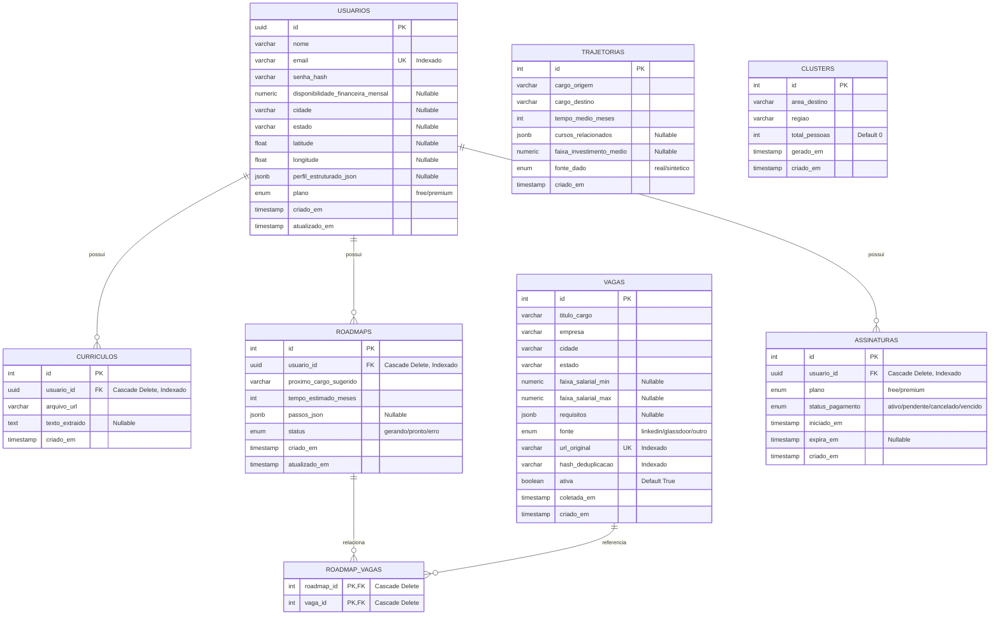

# Database Schema - Navegador de Carreira

Este documento descreve o modelo relacional do projeto, implementado em PostgreSQL via SQLAlchemy.

## Diagrama Entidade-Relacionamento (ERD)

## Notas Importantes:
- **`CLUSTERS`** é um agregado B2B estritamente anonimizado. Sem *Foreign Keys* ou referências para a tabela `USUARIOS`.
- Os índices na tabela de `VAGAS` otimizam as buscas compostas por cidade + cargo.
- Deleções em cascata foram configuradas para garantir limpeza de dados ao excluir um usuário.
